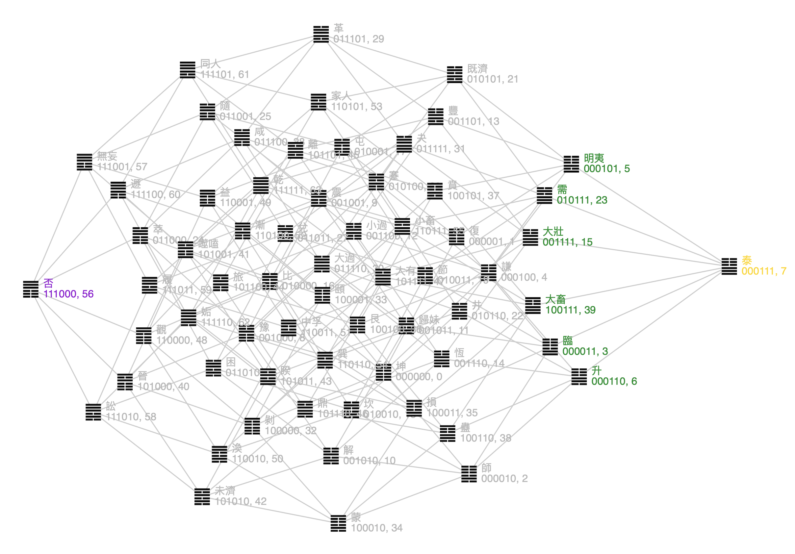

# I-Ching Hexagrams Relation Visualization (易經64卦相關係圖）
This interactive tool helps you visualize the relations between the Hexagrams. Play and learn [here](https://lqu.github.io/iching-vis/) 
## Features
* Shows Hamming distance between any two Hexagrams
* Supports drag-n-drop of any Hexagram
* Graph reshapes itself automatically, and keeps all properties
* Color highlight relate Hexagrams (self/selected, adjacent, opposite/negate, reverse)

## Demo
https://github.com/lqu/iching-vis/assets/432856/75aa0dbd-0d6a-405e-a91c-994722fe902c

## Screenshots

## Notes
This visualization is to expand the Hamming Space from 3D to six dimentions, from a cube to a 6-cube like this. 

 =>> 

In the 6-cube representation, 
an edge exists if two nodes have an Hamming distance of one, meaning the binary forms differ at only one digit,
e.g. 111001 and 110001.
