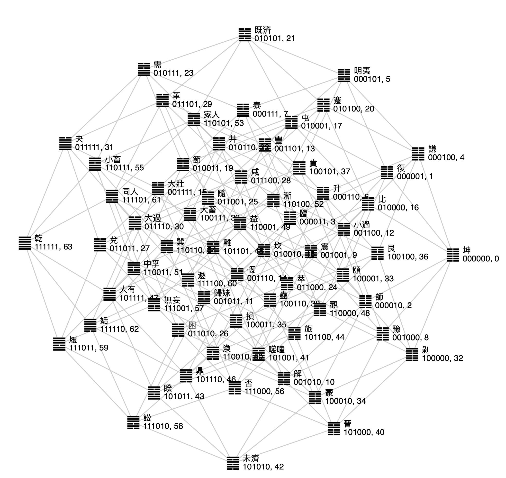
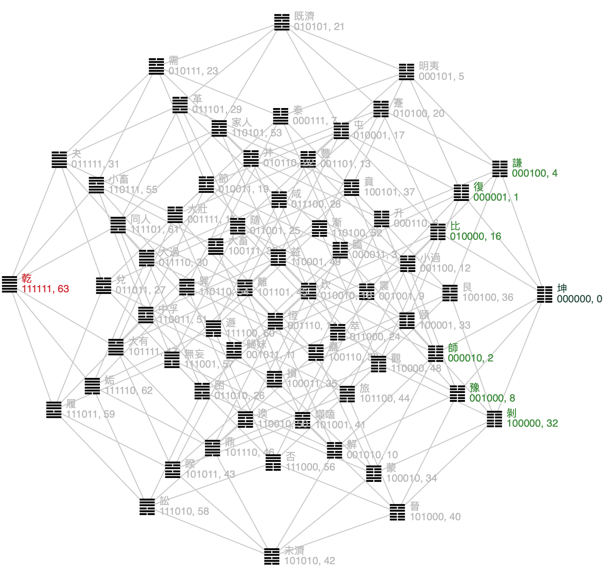
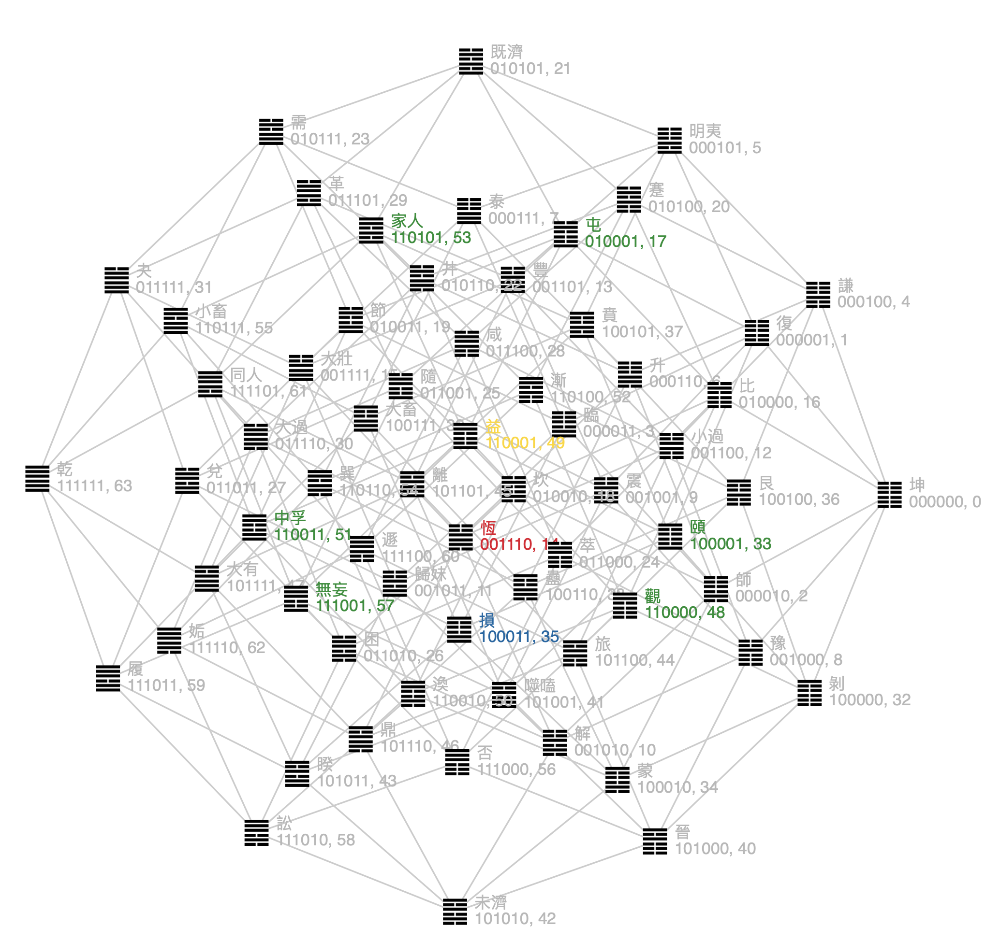

# I-Ching Hexagrams Relation Visualization (易經64卦相關係圖）
This interactive tool helps you visualize the relations between the Hexagrams. Play and learn [here](https://lqu.github.io/iching-vis/) 

## Demo

## Screenshots

## Notes
In the 6-cube representation, 
an edge exists if two nodes have an Hamming distance of one, meaning the binary forms differ at only one digit,
e.g. 111001 and 110001.
